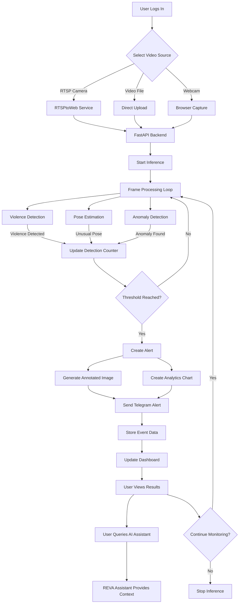

# 🔍 IndustriWatch

> *Intelligent video monitoring with real-time anomaly detection*

## 🚀 Project Overview

Welcome to the IndustriWatch! We've built a powerful AI-driven platform that watches your video feeds 24/7 to detect unusual behaviors, security threats, and emergency situations. Whether you're monitoring a retail space, warehouse, or public area, our system helps you stay one step ahead with instant alerts and comprehensive analytics.

## 📋 Table of Contents

- [✨ Features](#features)
- [🏗️ System Architecture](#system-architecture)
- [🧩 Components](#components)
- [🔧 Installation](#installation)
- [🎮 Usage](#usage)
- [📡 API Reference](#api-reference)
- [💻 Technology Stack](#technology-stack)
- [🤝 Contributing](#contributing)

## ✨ Features

- **🧠 Multi-model AI Detection**:
  - Violence detection for immediate security response
  - Pose anomaly detection (falling, lying, crouching) to identify medical emergencies
  - Object detection (fire, smoke, weapons, blood) for comprehensive threat assessment

- **📹 Video Source Flexibility**:
  - RTSP camera streams from existing security systems
  - Video file and web integrations for easy access

- **📱 Real-time Notifications**:
  - Telegram alerts with captured images of incidents
  - Analytics charts showing detection patterns
  
- **📊 Interactive Dashboard**:
  - Live video monitoring with detection overlays
  - Detection statistics updated in real-time
  - Historical data visualization for trend analysis

- **🤖 AI Assistant**:
  - Conversational interface via Telegram
  - Context-aware responses about system state

## 🏗️ System Architecture



### 🔄 Detailed System Data Flow

Ever wondered how we turn video feeds into intelligent alerts? Here's the journey your data takes through our system:

1. **Video Ingestion Layer**: 
   - First stop: Your video enters from RTSP cameras, uploaded files, or webcams
   - For RTSP streams, our RTSPtoWeb service transforms them into web-friendly formats
   - Each frame is carefully extracted and queued for AI processing

2. **AI Processing Pipeline**:
   - Every frame gets the VIP treatment—analyzed by three specialized CV models simultaneously
   - Our violence detector spots aggressive behaviors with impressive accuracy
   - The pose estimator tracks human movement and calculates joint angles to detect falls or unusual postures
   - Meanwhile, our anomaly detector is scanning for dangerous objects like fire, smoke, or weapons
   - Each detection is counted, timestamped, and stored for pattern recognition

3. **Alert Processing Workflow**:
   - When something suspicious crosses our threshold, an alert springs into action
   - We capture the frame, highlight the detection, and generate a time-series chart for context
   - The whole package—image, chart, and alert message—is ready for delivery
   - A smart cooldown system prevents alert flooding (because nobody wants their phone buzzing non-stop)

4. **Data Storage and Management**:
   - Real-time counts stay in memory for instant dashboard updates
   - Historical events are carefully logged with timestamps for trend analysis
   - User preferences are securely stored in Supabase.

5. **Frontend Communication**:
   - Our React frontend stays in constant contact with the FastAPI backend
   - Video streams flow efficiently to your browser via WebRTC/HLS
   - Dashboard stats refresh automatically to keep you informed

6. **AI Assistant Integration**:
   - Meet REVA, your AI surveillance assistant built on the Agno framework
   - She has direct access to system data through a custom toolkit
   - Powered by Google Gemini, she understands natural language queries about your system
   - Chat with her through Telegram or the web interface—she remembers your conversation context

This architecture delivers real-time monitoring with impressively low latency, while maintaining a modular design that can easily grow with your needs.

## 🧩 Components

### 1. Backend (api.py)

The brain of our operation—a FastAPI application that:

- Processes video streams using state-of-the-art CV models
- Manages user authentication and preferences
- Handles Telegram notifications with rich media
- Serves API endpoints for the frontend dashboard

### 2. Frontend

A responsive React interface that brings surveillance data to life:

- Secure user authentication flow
- High-performance video streaming player
- Interactive analytics dashboard with filtering
- Customizable settings management
- Simple local media upload interface

### 3. RTSPtoWeb

Instead of bundling our own solution, we integrate with the excellent [RTSPtoWeb](https://github.com/deepch/RTSPtoWeb) open-source project. This Go service:

- Converts RTSP camera streams to web-friendly formats
- Provides HTTP, WebRTC, and HLS endpoints for browser compatibility
- Enables efficient web viewing of IP camera feeds
- Handles stream authorization and security

### 4. CV Models Used

Our system leverages three cutting-edge detection models:

- **YOLO Violence Detection**: Fine-tuned on a large set of dataset to identify aggressive actions and confrontations
- **YOLOv8 Pose Estimation**: Maps human body keypoints to detect falls and unusual postures
- **YOLOE Segmentation**: Leverages the use of visual prompts for efficient detetctions and segmentations, removing the necessity of mentioning fixed label categories and fine-tuning.

### 5. AI Assistant

Meet REVA, your surveillance companion:

- Built on the Agno framework, a powerful agent-based AI platform
- Powered by Google's Gemini 2.5 Flash model for natural conversations
- Equipped with a custom toolkit to access real-time surveillance metrics
- Maintains conversation history in SQLite for personalized interactions
- Available through Telegram for on-the-go system monitoring
- Ask her anything from "How many alerts today?" to "Show me detection trends"

## 🔧 Installation

### Prerequisites

- Python 3.8+ (3.10 recommended for best performance)
- Node.js 14+ (16+ preferred)
- Go 1.17+ (for RTSPtoWeb)
- CUDA-compatible GPU highly recommended for real-time processing

### Backend Setup

1. Clone our repository:
   ```bash
   git clone https://github.com/AtharshKrishnamoorthy/NAVIGATE-LABS-CP.git
   cd NAVIGATE-LABS-CP
   ```

2. Create a virtual environment:
   ```bash
   python -m venv .venv
   source .venv/bin/activate  # On Windows: .venv\Scripts\activate
   ```

3. Install dependencies:
   ```bash
   pip install -r requirements.txt
   ```

4. Create a `.env` file with your credentials:

   - In main dir .env
   ```
   TELEGRAM_BOT_ID=your_telegram_bot_token
   TELEGRAM_CHAT_ID=your_telegram_chat_id
   GOOGLE_API_KEY=your_gemini_api_key
   ```
   - In frontend folder .env
     
   ```
   SUPABASE_URL=your_supabase_url
   SUPABASE_KEY=your_supabase_key
   ```

### Frontend Setup

1. Navigate to the frontend directory:
   ```bash
   cd frontend
   ```

2. Install dependencies:
   ```bash
   npm install
   ```

3. Create a `.env` file for your frontend:
   ```
   REACT_APP_BACKEND_URL=http://localhost:5000
   ```

### RTSPtoWeb Setup

1. Clone the RTSPtoWeb repository:
   ```bash
   git clone https://github.com/deepch/RTSPtoWeb.git
   cd RTSPtoWeb
   ```

2. Build or use pre-compiled binaries:
   ```bash
   go build
   # Or download pre-compiled executable from releases
   ```

3. Configure your stream sources in `config.json`

## 🎮 Usage

1. Start the backend server:
   ```bash
   python api.py
   ```

2. Launch the frontend:
   ```bash
   cd frontend
   npm start
   ```

3. Run RTSPtoWeb:
   ```bash
   cd RTSPtoWeb
   ./RTSPtoWeb  # On Windows: RTSPtoWeb.exe
   ```

4. Open your browser and navigate to http://localhost:3000

5. Log in, connect your video sources, and start monitoring!

## 📡 API Reference

### Main Endpoints

- `POST /api/start`: Launch surveillance on your specified video source
- `POST /api/stop`: Pause ongoing surveillance
- `GET /api/status`: Check current surveillance status and detection counts

## 💻 Technology Stack

- **Backend**: FastAPI, Python, PyTorch, OpenCV
- **Frontend**: React, Chart.js
- **Streaming**: RTSPtoWeb (Go)
- **AI Models**: YOLO, YOLOv8-pose, YOLOE
- **Database**: Supabase (PostgreSQL)
- **AI Assistant**: Agno Agent with Gemini
- **Notifications**: Telegram API

## 🤝 Contributing

We welcome contributions from the community! Here's how to get started:

1. Fork the repository
2. Create your feature branch: `git checkout -b amazing-feature`
3. Make your changes and commit them: `git commit -m 'Add amazing feature'`
4. Push to your branch: `git push origin amazing-feature`
5. Open a pull request

Let's make surveillance smarter together!
